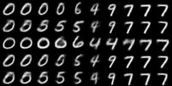

# VAE Pytorch Models
---
## Vanilla VAE - master branch
### paper
1. [Auto-Encoding Variational Bayes](https://arxiv.org/pdf/1312.6114.pdf)
  

***
## Beta VAE - BetaVAE branch
  
Both version of Higgins et al., Burgess et al. are implemented.
### paper
1. [β-VAE: LEARNING BASIC VISUAL CONCEPTS WITH A CONSTRAINED VARIATIONAL FRAMEWORK](https://openreview.net/references/pdf?id=Sy2fzU9gl) -  Higgins et al.
2. [Understanding disentangling in β-VAE](https://arxiv.org/pdf/1804.03599.pdf) - Burgess et al.

***
## Requirements

### Essential dependencies

- python=3.6.13
- torch==1.7.1+cu110
- torchvision==0.8.2+cu110
- json
- tensorboard

### Use requirements.txt files
```
# create same conda environment

conda env create -f conda_requirements.txt
```

```
pip install -r requirements.txt
```
## Train / Test

Use following command
```
python main.py <config file path>
```

## Config file

- train : 1 (Train the VAE)
- train : 0 (test the VAE)

```
{
    "id": "betavae_mnist",
    "model": "BetaVAE",
    "dataset": "mnist",
    "path_to_data": "./data",
    "train" : 0,  
    "resolution": 28,
    "latent_dim": 3,
    "hidden_dims": [32, 64, 128],
    "encoder":{
        "layer_configs":
        [
        {
            "in_channels": 1,
            "out_channels": 32, 
            "kernel_size": 3,
            "stride": 2,
            "padding": 1
        },
        {
            "in_channels": 32,
            "out_channels": 64, 
            "kernel_size": 3,
            "stride": 2,
            "padding": 1
        },
        {
            "in_channels": 64,
            "out_channels": 128, 
            "kernel_size": 3,
            "stride": 2,
            "padding": 1
        }
        ]
    },
    "fc_mu_var":{
        "in_channels": 2048, 
        "out_channels": 3
    },
    "decoder":{
        "layer_configs":
        [
        {
            "in_channels": 128,
            "out_channels": 64, 
            "kernel_size": 3,
            "stride": 2,
            "padding": 1,
            "output_padding": 0
        },
        {
            "in_channels": 64,
            "out_channels": 32, 
            "kernel_size": 3,
            "stride": 2,
            "padding": 1,
            "output_padding": 1
        },
        {
            "in_channels": 32,
            "out_channels": 32, 
            "kernel_size": 3,
            "stride": 2,
            "padding": 1,
            "output_padding": 1
        },
        {
            "in_channels": 32,
            "out_channels": 1, 
            "kernel_size": 3,
            "stride": 1,
            "padding": 1
        }

        ]

    },
    "training": {
        "max_iters": 1e6,
        "resume_iters": 0,
        "capacity_iters": 1e5, 
        "restored_model_path": "",
        "beta": 4.0,
        "gamma": 10.0,
        "max_capacity": 25.0,
        "loss_type":"B", 
        "kld_weight": 0.00027,
        "batch_size": 64,
        "lr": 1e-4,
        "weight_decay": 0.0,
        "beta1" : 0.9,
        "beta2" : 0.999,
        "milestones": [], 
        "scheduler_gamma": 0.95,
        "print_freq": 100,
        "sample_freq": 2000,
        "model_save_freq": 5000,
        "manual_seed": 1265
    },
    "test":{
        "test_iters": 115000,
        "batch_size" : 16,
        "test_dim" : 2,
        "test_seed" : [42, 62, 1024, 72, 92] ,
        "start": -3.0,
        "end": 3.0,
        "steps": 10,
        "test_path": "/home/hankyu/hankyu/disentangle/vae/betavae_mnist_lossH"
    }
}
```
## Results

### MNIST DATASET
#### Latent Traversal
  
|Dimension| Higgins et al. | Burgess et al. |
|:--------:|:------------------:|:--------------------:|
|0| | |
|1| ||
|2| | |

### CelebA DATASET
#### Latent Traversal

| Feature | Higgins et al. | Burgess et al. |
|:--------:|:------------------:|:--------------------:|
| Azimuth | | |
|Red/Blue| ||
|Skin Tone1| | |
|Skin Tone2| | |
|Hair Color| | |
|Smile| | |


## code reference for network base frameworks: 
1. https://github.com/AntixK/PyTorch-VAE 
2. https://github.com/yunjey/stargan
3. https://github.com/EmilienDupont/neural-function-distributions 
4. https://github.com/adityabingi/Beta-VAE - Latent Traversal